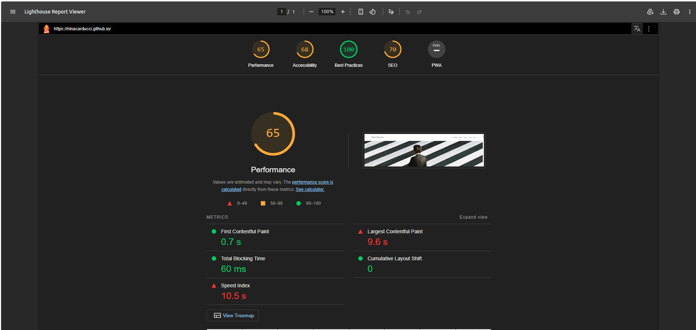
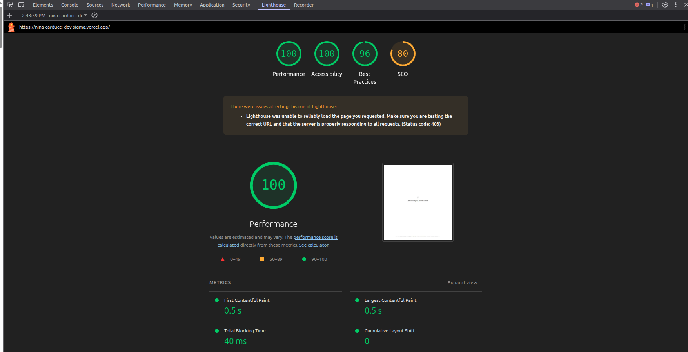

# Intervention Report

**Client:** Nina Carducci

## I - Lighthouse Score

### Lighthouse score before optimisation

### Lighthouse score after optimisation

## II - Details of optimisations and interventions carried out

### 1 - Images
- Optimized project contains 39 images in `assets/images`.
- Current total image size: 4.4 MB.
- Original project contains 15 images in `assets/images` with a total size of 30 MB.

**Changes performed:**
- Converted images from JPEG/PNG to `WebP` format to reduce file size.
- Added responsive versions using `srcset` and `sizes` for the gallery and slider.
- Used `loading="lazy"` on gallery images so they load only when they enter the viewport.
- Added `decoding="async"`, fixed `width`/`height`, and `fetchpriority="high"` on the hero slider image to improve LCP.
- Preloaded critical CSS (`bootstrap.min.css`, `style.css`) and the main slider image.

**After modifications:**
- Total image weight: 4.4 MB.
- Size reduction gain: [Insert percentage gain after comparing with the prior state].

### Comparison with the original project
- Original project used 15 image files totaling 30 MB, while the optimized project uses 39 image files totaling 4.4 MB.
- The higher file count in the optimized version reflects responsive image variants and separate sizes for different screen widths, which increases performance despite more files.
- Original assets were heavier because they were mostly full-size JPEG/PNG images without responsive `srcset` and without lazy loading.
- Original project used unminified `bootstrap.css` and `bootstrap.bundle.js`, and scripts were loaded without `defer`.
- Optimized project uses `bootstrap.min.css`, `bootstrap.bundle.min.js`, `maugallery.min.js`, and `defer` on all scripts to reduce render-blocking.
- Original project had accessibility gaps: missing `alt` text on some images, no `aria-label` on the Instagram link, and inconsistent heading hierarchy. These were corrected in the optimized version.

### 2 - Code and resource optimisation
- Switched to `bootstrap.min.css` instead of the unminified `bootstrap.css` used in the original project.
- Loaded scripts with `defer` to avoid render-blocking, while the original project loaded its scripts synchronously:
  - `bootstrap.bundle.min.js`
  - `jquery-3.4.1.min.js`
  - `maugallery.min.js`
  - `scripts.js`
- Optimized font loading with `preconnect` and `preload` for `fonts.googleapis.com`.
- Reduced JavaScript and kept external dependencies lightweight.
- Added a minified `maugallery.min.js` file in the optimized project; the original used the unminified `maugallery.js`.
- Main current assets:
  - `assets/bootstrap/bootstrap.min.css` — 164 KB
  - `assets/bootstrap/bootstrap.bundle.min.js` — 80 KB
  - `assets/maugallery.min.js` — 8 KB
  - `assets/scripts.js` — 4 KB
  - `assets/style.css` — 8 KB

### 3 - SEO and structured data
- Optimized meta description present in `<head>`.
- Implemented Schema.org `LocalBusiness` markup for professional photography:
  - business name
  - address
  - phone number
  - URL
  - services offered
- Added `alt` attributes to all key images.
- Used semantic headings and sectioning (`<main>`, `<h1>`, `<h2>`, `<h3>`).

### 4 - Accessibility improvements
- Added descriptive alternative text to all images.
- The Instagram link includes `aria-label` for accessible external linking.
- Carousel buttons include appropriate hidden text (`visually-hidden`).
- Contact form fields use `<label>` elements correctly associated with inputs.
- Maintained a consistent heading structure to support screen reader navigation.

## III - Site accessibility

### Accessibility before optimisation

### Accessibility after optimisation

### Changes made
- Added alt text to all key images.
- Added `aria-label` to the Instagram link.
- Improved the semantic heading structure and content grouping.
- Ensured carousel controls are keyboard accessible and screen reader friendly.
- Verified the contact form labels are correctly connected to each field.

## IV - Details of additional work carried out at the customer's request
- No additional customer-requested work was included in this deliverable.
- If requested, additional improvements can be made such as:
  - further mobile bandwidth optimisation,
  - implementation of a functional contact form backend,
  - adding structured data for reviews or events.

## V - Acceptance log

| ID | Action | Initial result | Expected result | Status | Remarks and comments |
| --- | --- | --- | --- | --- | --- |
| 1 | Image optimisation | Heavy images without responsive sources | Responsive WebP images with `srcset` | [ ] | Current image weight 4.4 MB, lazy loading added |
| 2 | CSS/JS optimisation | Unminified / render-blocking CSS and JS | Minified CSS, `defer` scripts | [ ] | Bootstrap and critical resources preloaded |
| 3 | Accessibility improvement | Partial accessibility support | All images with `alt`, links with `aria-label`, accessible form | [ ] | Semantic structure improved |
| 4 | Technical SEO | Missing structured data | Schema.org LocalBusiness + meta description | [ ] | JSON-LD implemented correctly |

### To do / Solved
- [ ] Capture Lighthouse before/after.
- [ ] Capture Wave before/after.
- [ ] Add actual score data and percentage gain after testing.
- [ ] Complete appendix with the full Lighthouse report.

## Appendix
- Full Lighthouse audit report
