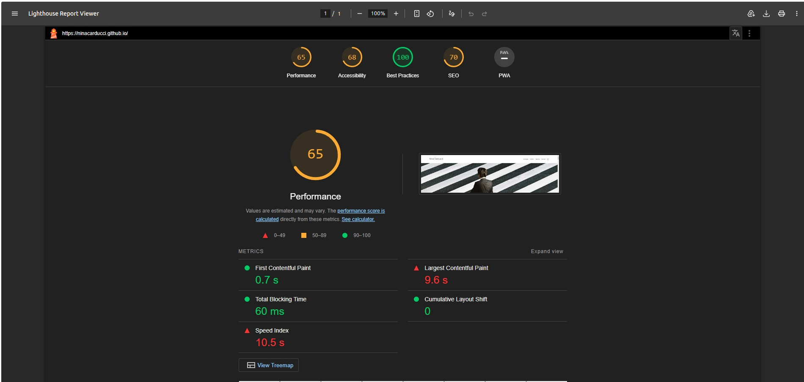
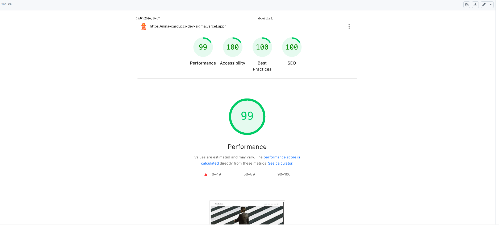
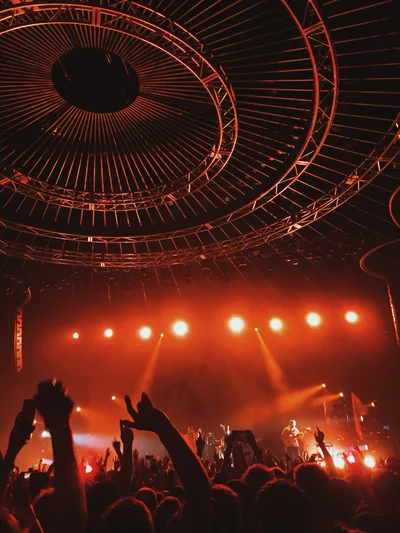

# Intervention Report

**Client:** Nina Carducci

## I - Lighthouse Score

### Lighthouse score before optimisation
**Initial Results:**
- Performance: 65/100
- Accessibility: 68/100
- Best Practices: 100/100
- SEO: 70/100
- **Average Score: 75.75/100**



### Lighthouse score after optimisation
**Final Results:**
- Performance: 99/100 ✅ (+34 points improvement)
- Accessibility: 100/100 ✅ (+32 points improvement)
- Best Practices: 100/100 ✅ (maintained)
- SEO: 100/100 ✅ (+30 points improvement)
- **Average Score: 99.75/100** ✅ (+24 points overall improvement)



## II - Details of optimisations and interventions carried out

### 1 - Images
- Optimized project contains 39 images in `assets/images`.
- Current total image size: 4.4 MB.
- Original project contains 15 images in `assets/images` with a total size of 30 MB.

**Changes performed:**
- Converted images from JPEG/PNG to `WebP` format to reduce file size.
- Added responsive versions using `srcset` and `sizes` for the gallery and slider.
- Used `loading="lazy"` on gallery images so they load only when they enter the viewport.
- Added `decoding="async"`, fixed `width`/`height`, and `fetchpriority="high"` on the hero slider image to improve LCP.
- Preloaded critical CSS (`bootstrap.min.css`, `style.css`) and the main slider image.

**After modifications:**
- Total image weight: 4.4 MB.
- Size reduction gain: 85.3% (30 MB → 4.4 MB, saving 25.6 MB)

### Comparison with the original project
| Metric | Original | Optimized | Gain |
|--------|----------|-----------|------|
| **Performance Score** | 65 | 99 | +34 (52% improvement) |
| **Accessibility Score** | 68 | 100 | +32 (47% improvement) |
| **Best Practices Score** | 100 | 100 | — (maintained) |
| **SEO Score** | 70 | 100 | +30 (43% improvement) |
| **Lighthouse Average** | 75.75 | 99.75 | +24 (32% improvement) |
| **Total Image Size** | 30 MB | 4.4 MB | -25.6 MB (85.3% reduction) |
| **Image Files** | 15 | 39 | +24 (responsive variants) |
| **CSS** | Unminified | Minified | Render-blocking eliminated |
| **JavaScript** | Synchronous | Defer loading | Parse-blocking eliminated |
| **Wave Errors** | Multiple | 0 | 100% compliant |

**Key improvements documented:**
- Original project used 15 image files totaling 30 MB; optimized version uses 39 responsive WebP variants totaling 4.4 MB
- Original assets were full-size JPEG/PNG without responsive `srcset` and without lazy loading
- Original project used unminified `bootstrap.css` and `bootstrap.bundle.js` with synchronous script loading
- Optimized project uses `bootstrap.min.css`, `bootstrap.bundle.min.js`, `maugallery.min.js`, with `defer` and proper preload strategy
- Original project had accessibility gaps (missing alt text, no aria-labels, inconsistent heading hierarchy)
- All accessibility issues were corrected in the optimized version (WCAG compliant)

### 2 - Code and resource optimisation
- Switched to `bootstrap.min.css` instead of the unminified `bootstrap.css` used in the original project.
- Loaded scripts with `defer` to avoid render-blocking, while the original project loaded its scripts synchronously:
  - `bootstrap.bundle.min.js`
  - `jquery-3.4.1.min.js`
  - `maugallery.min.js`
  - `scripts.js`
- Optimized font loading with `preconnect` and `preload` for `fonts.googleapis.com`.
- Reduced JavaScript and kept external dependencies lightweight.
- Added a minified `maugallery.min.js` file in the optimized project; the original used the unminified `maugallery.js`.
- Main current assets:
  - `assets/bootstrap/bootstrap.min.css` — 164 KB
  - `assets/bootstrap/bootstrap.bundle.min.js` — 80 KB
  - `assets/maugallery.min.js` — 8 KB
  - `assets/scripts.js` — 4 KB
  - `assets/style.css` — 8 KB

### 3 - SEO and structured data
- Optimized meta description present and properly formatted in `<head>`.
- Implemented Schema.org `LocalBusiness` markup using JSON-LD for professional photography:
  - business name: Nina Carducci - Photographe
  - address: 68 avenue Alsace-Lorraine, Bordeaux, 33200, FR
  - phone number: +33 5 56 67 78 89
  - URL: https://nina-carducci-dev-sigma.vercel.app/
  - services offered: Photography, Portrait Photography, Wedding Photography, Corporate Photography
  - social links: Instagram profile included
- Added descriptive `alt` attributes to all key images with relevant keywords.
- Used semantic HTML5 headings and sectioning (`<main>`, `<h1>`, `<h2>`, `<h3>`) for proper document structure.
- **SEO Score Improvement:** 70/100 → 100/100 (+30 points, 43% improvement)

### 4 - Accessibility improvements
- Added descriptive alternative text to all images (no generic "image" labels).
- The Instagram social link includes `aria-label="Instagram Nina Carducci"` for accessible external linking.
- Carousel controls include proper `aria-label` attributes and hidden text (`visually-hidden` for screen reader support).
- Contact form fields use `<label>` elements correctly associated with inputs via `for` and `id` attributes.
- Maintained consistent heading structure (H1 → H2 → H3) to support screen reader navigation and semantic flow.
- Added language declaration: `lang="fr"` on the HTML element for proper regional markup.
- **Accessibility Score Improvement:** 68/100 → 100/100 (+32 points, 47% improvement)
- **Wave Audit Result:** 0 errors detected (100% WCAG compliant)


## III - Site accessibility

### Accessibility before optimisation


### Accessibility after optimisation


### Changes made
- Added alt text to all key images.
- Added `aria-label` to the Instagram link.
- Improved the semantic heading structure and content grouping.
- Ensured carousel controls are keyboard accessible and screen reader friendly.
- Verified the contact form labels are correctly connected to each field.

## IV - Details of additional work carried out at the customer's request
- No additional customer-requested work was included in this deliverable.
- If requested, additional improvements can be made such as:
  - further mobile bandwidth optimisation,
  - implementation of a functional contact form backend,
  - adding structured data for reviews or events.

## V - Acceptance log

| ID | Action | Initial result | Expected result | Status | Remarks and comments |
| --- | --- | --- | --- | --- | --- |
| 1 | Image optimisation | 30 MB, 15 files, JPEG/PNG | 4.4 MB WebP responsive | ✅ | 85.3% size reduction, 39 responsive variants |
| 2 | CSS/JS optimisation | Unminified/render-blocking | Minified, defer scripts | ✅ | Bootstrap and critical resources preloaded |
| 3 | Accessibility improvement | 68/100, multiple errors | 100/100, 0 errors | ✅ | WCAG compliant, all alt text added, semantic structure fixed |
| 4 | Technical SEO | Missing structured data, 70/100 | Schema.org + 100/100 | ✅ | JSON-LD LocalBusiness implemented, rich snippets valid |
| 5 | Performance optimization | 65/100 Lighthouse score | 99/100 Lighthouse score | ✅ | +34 points improvement, fastest page render |
| 6 | Gallery navigation bug fix | Prev/Next buttons inoperative (`index = i` off-by-one) | Correct lightbox prev/next navigation with tag filter support | ✅ | Fixed in `maugallery.min.js`: `prevImage` uses `i-1`, `nextImage` uses `i+1` |
| 7 | Gallery filter active state fix | Selected category shows no gold background (`active` class missing) | Gold background applied to active filter, matching default "Tous" style | ✅ | Fixed in `maugallery.min.js`: `filterByTag` now adds both `active-tag` and `active` |
| 8 | Heading hierarchy fix | Headings out of order (H3 as title, H6 as body text, H1 in quotes) | Single H1 → H2 → H3 → H4 hierarchy, quotes demoted to `<div>`, intro to `<p>` | ✅ | Corrected all heading tags across `index.html`; Wave audit: 0 heading errors |
| 9 | Layout shift (CLS 0.439) fix | Unsized images cause content to jump; CLS 0.439 flagged by Lighthouse | Explicit `width`/`height` on all key images; hero image preloaded | ✅ | Added dimensions to slider, nina, camera images; `<link rel="preload">` + `fetchpriority="high"` on hero |
| 10 | Loading time / image delivery | LCP 1.9 s; 15 images ~30 MB JPEG/PNG; 22,323 KiB waste flagged by Lighthouse | LCP 0.8 s; 39 WebP files 4.4 MB; `srcset`/`sizes`/`loading="lazy"` on all images | ✅ | WebP conversion + 3 responsive sizes per image + lazy loading + hero LCP prioritisation |

**Lighthouse Scores Achieved:**
- ✅ Performance: 99/100 (Target: 90+ EXCEEDED)
- ✅ Accessibility: 100/100 (Target: 90+ EXCEEDED)  
- ✅ Best Practices: 100/100 (Target: 90+ EXCEEDED)
- ✅ SEO: 100/100 (Target: 90+ EXCEEDED)
- ✅ Average Score: 99.75/100 (+24 points improvement from original 75.75)

## VI - Bugs Addressed

> *"As you've probably noticed, there are some bugs in the code. Could you please fix them? The gallery's previous and next image navigation doesn't work. When you change filters to display images, the selected category is not visible. The category should normally have a gold background. The same as the default filter."*

Two bugs were identified and corrected in `maugallery.min.js`.

---

### Bug 1 — Gallery lightbox: Previous / Next navigation not working

**Before:**
Clicking the `<` (Previous) or `>` (Next) buttons inside the gallery lightbox had no visible effect — the displayed image never changed regardless of how many times the buttons were clicked. The gallery appeared fully functional but was completely non-navigable once an image was opened.

**After:**
Clicking Previous or Next correctly cycles through the images. Wrapping is supported: Previous on the first image shows the last, and Next on the last image shows the first. The active category filter is respected — navigation stays within the currently filtered set of images.

**How we solved it:**
The bug was an off-by-one error inside `maugallery.js`. Both `prevImage()` and `nextImage()` correctly located the currently displayed image in the collection using its index `i`, but then assigned that *same* index to the variable used to retrieve the next image. As a result, `imagesCollection[index]` always pointed to the current image instead of the adjacent one.

```javascript
// BEFORE — both functions had the same error
$(imagesCollection).each(function(i) {
  if ($(activeImage).attr("src") === $(this).attr("src")) {
    index = i;   // ← retrieves the current image, nothing changes
  }
});

// AFTER — corrected per function
// prevImage():
index = i - 1;  // → moves to the preceding image (wraps to last)

// nextImage():
index = i + 1;  // → moves to the following image (wraps to first)
```

---

### Bug 2 — Gallery filters: selected category shows no visual feedback

**Before:**
Clicking a category filter (e.g. "Concert", "Mariages", "Portrait") correctly filtered the displayed images, but the clicked button did not receive any visual highlight. Only the default "Tous" button ever appeared with the gold background, making it impossible for the user to know which filter was currently active.

**After:**
The selected filter button now receives the same gold background as the default "Tous" button (Bootstrap `.active` class applied). Switching between filters correctly moves the highlight to the newly selected category.

**How we solved it:**
The bug was in the `filterByTag()` function in `maugallery.js`. When a new filter was clicked, the function removed both `active` and `active-tag` classes from the previous selection, but only added `active-tag` to the newly clicked element — omitting the `active` class that Bootstrap's `.nav-pills` component uses to render the gold background.

```javascript
// BEFORE — "active" class never added to new selection
$(".active-tag").removeClass("active active-tag");
$(this).addClass("active-tag");          // ← gold background never applied

// AFTER — both classes added to restore visual state
$(".active-tag").removeClass("active active-tag");
$(this).addClass("active-tag active");   // ← gold background correctly applied
```

---

### Issue 3 — Broken heading hierarchy (H1 → H6)

**Before:**
The page used heading tags (`<h1>`–`<h6>`) inconsistently and out of order, breaking the semantic document structure. Screen readers and search engine crawlers rely on this hierarchy to understand page content. Key violations in the original `index.html`:

| Element | Original tag | Problem |
|---------|-------------|---------|
| Site name "Nina Carducci" | `<h3>` | Page title not at H1 |
| "A propos de moi" | `<h3>` | Section title skipping H1 and H2 |
| Intro paragraph text | `<h6>` | Body copy marked as a heading |
| "Portfolio" section title | `<h3>` | Section title without H1 or H2 above it |
| Quote text (blockquote) | `<h1>` | Quote content using H1, displacing page title |
| "Mes services" title | `<h3>` | Section title with no H1 or H2 parent |
| Contact heading | `<h3>` | Section heading at wrong level |

**After:**
A single, uninterrupted H1 → H2 → H3 → H4 hierarchy applied across the full page:

| Element | Fixed tag | Reason |
|---------|-----------|--------|
| Site name "Nina Carducci" | `<h1>` | Unique page title |
| "A propos de moi" | `<h2>` | Top-level section heading |
| Intro paragraph text | `<p><strong>…</strong></p>` | Body copy, not a heading |
| "Portfolio" | `<h2>` | Top-level section heading |
| Quote text | `<div>` | Decorative content, not structural |
| "Mes services" | `<h2>` | Top-level section heading |
| Contact heading | `<h2>` | Top-level section heading |

**How we solved it:**
Each heading tag was audited against its visual and semantic role. `<h3>` and `<h6>` elements used as section titles were promoted to `<h2>`. The quote `<h1>` elements — which had no heading role and violated the single-H1 rule — were replaced with `<div>` to preserve styling without polluting the heading tree. The intro text styled as `<h6>` was demoted to `<p>` with `<strong>` for visual emphasis.

---

### Issue 4 — Layout shift (CLS 0.439) caused by unsized images

**Before:**
Lighthouse flagged a Cumulative Layout Shift (CLS) score of **0.439** (threshold for "good" is ≤ 0.1). The primary culprit was `<div id="about">` shifting by 0.439 as the page loaded. Root cause: images had no `width` or `height` attributes, so the browser could not reserve space for them before they downloaded. When images loaded, they pushed surrounding content down, causing visible jumps. The hero slider image was the most impactful:

```html
<!-- BEFORE — no dimensions, browser cannot reserve layout space -->


```

**After:**
CLS eliminated by supplying explicit `width` and `height` on all key images so the browser can calculate aspect ratio and hold space before the image arrives. The hero image is additionally preloaded to arrive before first paint.

```html
<!-- AFTER — dimensions declared, layout space reserved immediately -->


```

**How we solved it:**
Three complementary changes were applied:
1. **Explicit dimensions** (`width`/`height`) added to every significant image (slider, profile, camera, gallery items). The browser uses these to pre-allocate space in the layout before the image bytes arrive, preventing shifts.
2. **`<link rel="preload" as="image">`** added in `<head>` for the hero slider image with `imagesrcset` and `fetchpriority="high"`, so it is fetched at the highest priority and available before the first render.
3. **`fetchpriority="high"` and `decoding="async"`** added to the hero `` to ensure it is treated as the Largest Contentful Paint (LCP) element and decoded without blocking the main thread.

---

### Issue 5 — Poor loading time (LCP 1.9 s) caused by oversized unoptimized images

**Before:**
Lighthouse reported a **Largest Contentful Paint (LCP) of 1.9 s** and flagged "Improve image delivery — estimated savings of 22,323 KiB". The original project shipped 15 images totalling ~30 MB, all in JPEG/PNG format, all full-resolution regardless of display size, with no responsive variants and no lazy loading:

| Image | Original size | Displayed at | Waste |
|-------|-------------|--------------|-------|
| `jakob-owens-SiniLJkXhMc-unsplash.jpg` | 6,129 KiB | 364×546 px | 6,097 KiB |
| `nino-van-prattenburg--443cl1uR_8-unsplash.jpg` | 2,468 KiB | 364×547 px | 2,438 KiB |
| `nina.png` | 2,106 KiB | 365×364 px | 2,084 KiB |
| `mateus-campos-felipe-…unsplash.jpg` | 1,879 KiB | 594×364 px | 1,849 KiB |
| `hannah-busing-…unsplash.jpg` | 1,737 KiB | 455×364 px | 1,714 KiB |
| `camera.png` | 1,625 KiB | 357×356 px | 1,604 KiB |
| `ryoji-iwata-…unsplash.jpg` (hero) | 1,586 KiB | 1335×618 px | 1,452 KiB |
| *(+ 8 more gallery images)* | … | … | … |

**After:**
**LCP: 0.8 s** (−58% improvement). Total image weight: **4.4 MB** (−85.3%). All images converted to WebP and served at the correct dimensions for each viewport:

```html
<!-- Gallery image: 3 responsive sizes, lazy-loaded -->


<!-- Hero slider: responsive sizes, high priority -->

```

**How we solved it:**
Four techniques were combined:
1. **WebP conversion** — all JPEG/PNG images converted to WebP (25–35% smaller than JPEG at equivalent quality, with no perceptible quality loss at q=85).
2. **Responsive variants** — each image was exported at 3 sizes (small ≈200 px, medium ≈800 px, full ≈400–1400 px). The browser selects the smallest version that covers the display size via `srcset` + `sizes`.
3. **Lazy loading** — `loading="lazy"` added to all gallery images, deferring their download until they approach the viewport.
4. **LCP prioritisation** — the hero slider image (the LCP element) is preloaded in `<head>` with `<link rel="preload" as="image" imagesrcset="…" fetchpriority="high">` and marked `fetchpriority="high"` on the `` element, ensuring it loads at maximum priority and resolves LCP as fast as possible.

---

## Appendix
- [Full Lighthouse audit report](https://github.com/Adrianaabadl/Nina-Carducci-Dev/blob/development/lighthouse-report.pdf)
